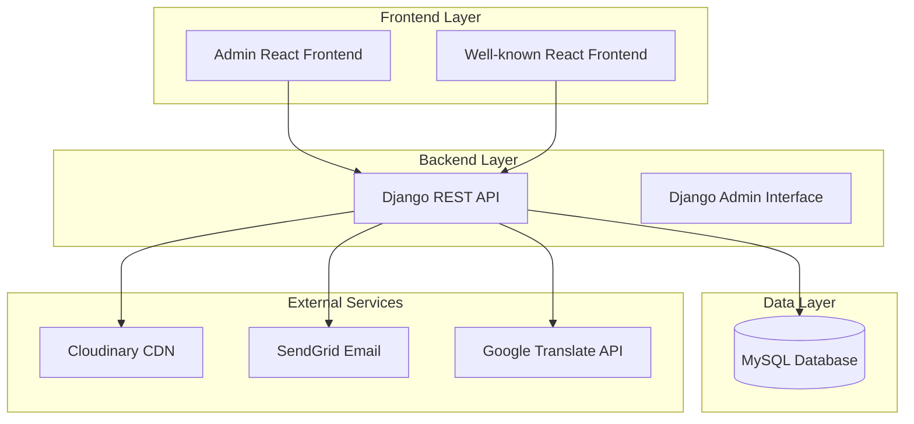
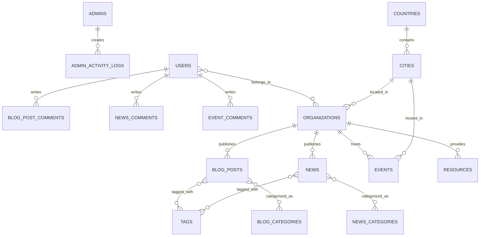
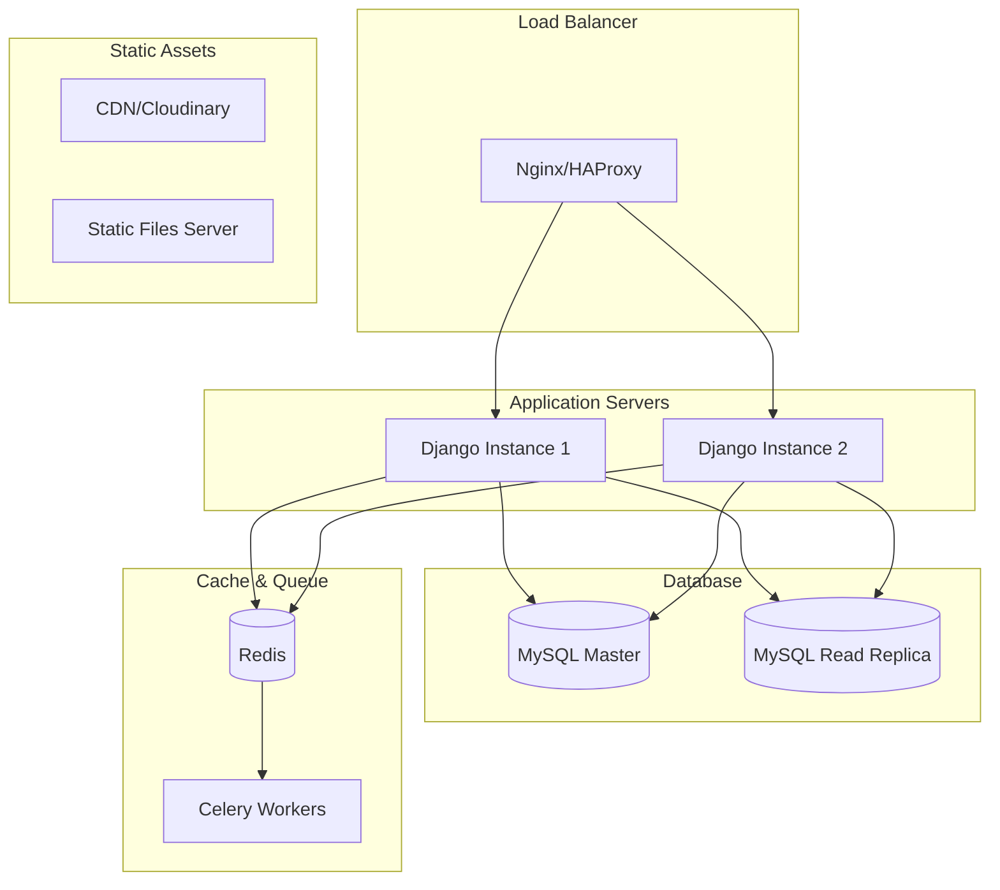

# Design Document

## Overview

This design outlines the architecture for rebuilding the existing CakePHP-based AU-VLP (African Union Youth Leadership Program) system using Django REST Framework for the backend API and React for the frontend applications. The system consists of two distinct applications:

1. **Admin Application**: A Django REST API backend with a React frontend for administrative interface
2. **Well-known Application**: A client-facing React frontend with Django backend for volunteers and organizations

The system will maintain the existing MySQL database structure while providing modern, scalable, and maintainable applications.

## Architecture

### High-Level Architecture



### Technology Stack

**Backend (Django)**
- Django 4.2+ with Django REST Framework
- MySQL database with existing schema
- Django Admin for content management
- JWT authentication for API access
- Celery for background tasks
- Redis for caching and task queue

**Frontend (React)**
- React 18+ with TypeScript
- React Router for navigation
- Axios for API communication
- Material-UI or Tailwind CSS for styling
- React Query for state management and caching
- i18next for internationalization

## Components and Interfaces

### Django Backend Components

#### 1. Models Layer
Django models will map directly to existing database tables:

**Core Models:**
- `Admin`: Maps to `admins` table for admin user management
- `User`: Maps to `users` table for regular users
- `Organization`: Maps to `organizations` table
- `BlogPost`: Maps to `blog_posts` table with translation support
- `News`: Maps to `news` table
- `Event`: Maps to `events` table
- `Resource`: Maps to `resources` table
- `ActivityLog`: Maps to `activity_logs` and `admin_activity_logs` tables

**Relationship Models:**
- Various junction tables for many-to-many relationships
- Category and tag associations
- User-organization relationships

#### 2. API Layer (Django REST Framework)
RESTful API endpoints organized by resource:

```
/api/v1/
├── auth/
│   ├── login/
│   ├── logout/
│   ├── refresh/
│   └── profile/
├── admin/
│   ├── users/
│   ├── organizations/
│   └── activity-logs/
├── blog/
│   ├── posts/
│   ├── categories/
│   └── comments/
├── news/
│   ├── articles/
│   ├── categories/
│   └── comments/
├── events/
├── resources/
├── organizations/
└── users/
```

#### 3. Authentication & Authorization
- JWT-based authentication for API access
- Role-based permissions (super_admin, admin, user)
- Django's built-in permission system
- Custom permission classes for API endpoints

#### 4. Admin Interface
Django Admin customization for:
- User management with role-based access
- Content management (blog posts, news, events)
- Organization management
- Activity log monitoring
- Translation management

### React Frontend Components

#### 1. Admin Application Structure
```
admin-frontend/
├── components/
│   ├── common/
│   ├── layout/
│   ├── forms/
│   └── ui/
├── pages/
│   ├── Dashboard/
│   ├── BlogManagement/
│   ├── UserManagement/
│   ├── OrganizationManagement/
│   └── ActivityLogs/
├── services/
│   ├── api/
│   ├── auth/
│   └── utils/
├── hooks/
├── context/
├── types/
└── utils/
```

#### 2. Well-known Application Structure
```
client-frontend/
├── components/
│   ├── common/
│   ├── layout/
│   ├── forms/
│   └── ui/
├── pages/
│   ├── Home/
│   ├── Blog/
│   ├── News/
│   ├── Events/
│   ├── Organizations/
│   └── Profile/
├── services/
│   ├── api/
│   ├── auth/
│   └── utils/
├── hooks/
├── context/
├── types/
└── utils/
```

#### 3. Key Components
- **Layout Components**: Header, Footer, Navigation, Sidebar
- **Content Components**: BlogList, NewsCard, EventCard, OrganizationCard
- **Form Components**: LoginForm, ContactForm, SearchForm
- **UI Components**: Modal, Pagination, LoadingSpinner, ErrorBoundary

#### 4. State Management
- React Query for server state management
- Context API for global application state
- Local state with useState/useReducer for component-specific state

## Data Models

### Core Entity Relationships



### Translation Support
The system supports multilingual content through the `i18n` table:
- Content stored with locale-specific translations
- Django's internationalization framework
- React i18next for frontend translations

## Error Handling

### Backend Error Handling
- Custom exception handlers for API responses
- Structured error responses with consistent format:
```json
{
  "error": {
    "code": "VALIDATION_ERROR",
    "message": "Invalid input data",
    "details": {
      "field_name": ["This field is required"]
    }
  }
}
```
- Logging integration with structured logging
- Sentry integration for error monitoring

### Frontend Error Handling
- Error boundaries for React component error catching
- Global error handling for API requests
- User-friendly error messages
- Retry mechanisms for failed requests
- Offline support with service workers

## Testing Strategy

### Backend Testing
- **Unit Tests**: Django's TestCase for model and utility testing
- **Integration Tests**: API endpoint testing with DRF test client
- **Database Tests**: Test database migrations and model relationships
- **Authentication Tests**: JWT token validation and permission testing

### Frontend Testing
- **Unit Tests**: Jest and React Testing Library for component testing
- **Integration Tests**: API integration testing with MSW (Mock Service Worker)
- **E2E Tests**: Cypress for critical user flows
- **Accessibility Tests**: axe-core integration for a11y compliance

### Test Coverage Goals
- Backend: 90%+ code coverage
- Frontend: 80%+ code coverage
- Critical paths: 100% coverage

## Security Considerations

### Backend Security
- CORS configuration for frontend domains
- Rate limiting on API endpoints
- Input validation and sanitization
- SQL injection prevention through ORM
- XSS protection with proper serialization
- CSRF protection for admin interface
- Secure password hashing (maintain compatibility with existing hashes)

### Frontend Security
- Content Security Policy (CSP) headers
- Secure token storage (httpOnly cookies or secure localStorage)
- Input sanitization for user-generated content
- Protection against XSS in rich text content

## Performance Optimization

### Backend Performance
- Database query optimization with select_related/prefetch_related
- Redis caching for frequently accessed data
- Database indexing on commonly queried fields
- Pagination for large datasets
- Background task processing with Celery

### Frontend Performance
- Code splitting with React.lazy()
- Image optimization and lazy loading
- React Query for efficient data fetching and caching
- Bundle optimization with Webpack
- CDN integration for static assets

## Deployment Architecture

### Production Environment


### Environment Configuration
- **Development**: Local development with Docker Compose
- **Staging**: Containerized deployment for testing
- **Production**: Kubernetes or Docker Swarm deployment
- **CI/CD**: GitHub Actions or GitLab CI for automated deployment

## Migration Strategy

### Phase 1: Backend Development
1. Set up Django project with existing database
2. Create models mapping to existing tables
3. Implement core API endpoints
4. Set up authentication system
5. Configure Django Admin

### Phase 2: Frontend Development
1. Set up Admin React application structure
2. Set up Well-known React application structure
3. Implement authentication flows
4. Create core components and pages
5. Integrate with Django API
6. Implement responsive design

### Phase 3: Integration & Testing
1. End-to-end testing
2. Performance optimization
3. Security audit
4. User acceptance testing
5. Documentation completion

### Phase 4: Deployment
1. Production environment setup
2. Database migration verification
3. Gradual rollout with monitoring
4. Legacy system decommissioning