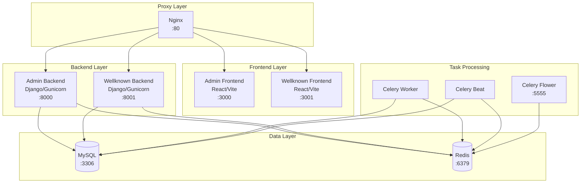

# Design Document

## Overview

The AU-VLP (African Union Youth Leadership Program) system is a multi-service Docker-based application consisting of Django backends, React frontends, MySQL database, Redis, Celery workers, and Nginx reverse proxy. The current deployment faces several critical infrastructure issues that prevent proper service startup and operation.

This design addresses systematic fixes for container orchestration, build processes, service dependencies, database connectivity, and error handling to ensure a stable development environment.

## Architecture

### Current System Architecture



### Problem Areas Identified

1. **Container Build Issues**: Frontend containers failing due to platform-specific build problems
2. **Service Dependencies**: Improper startup order causing connection failures
3. **Database Connectivity**: MySQL client library build failures in Python containers
4. **Configuration Management**: Environment variable and CORS configuration issues
5. **Resource Management**: Insufficient health checks and restart policies
6. **Development vs Production**: Mixed development and production configurations

## Components and Interfaces

### 1. Container Build System

**Purpose**: Ensure all Docker containers build successfully across different platforms

**Key Components**:
- **Multi-stage Dockerfiles**: Separate build and runtime stages for optimization
- **Platform-specific builds**: Handle ARM64 and AMD64 architecture differences
- **Dependency management**: Proper system package installation for MySQL clients
- **Build caching**: Optimize build times through layer caching

**Interfaces**:
- Docker Compose build context
- Platform-specific base images
- Volume mounts for development

### 2. Service Orchestration

**Purpose**: Manage service startup order and dependencies

**Key Components**:
- **Health checks**: Container health monitoring
- **Dependency management**: Proper service startup sequencing
- **Wait strategies**: Database and Redis connection waiting
- **Restart policies**: Automatic recovery from failures

**Interfaces**:
- Docker Compose depends_on with conditions
- Health check endpoints
- Inter-service communication protocols

### 3. Database Integration

**Purpose**: Ensure reliable database connectivity and migration handling

**Key Components**:
- **Connection pooling**: Efficient database connection management
- **Migration strategy**: Safe handling of existing database schema
- **Backup integration**: Support for database import/export
- **Connection monitoring**: Database health checks

**Interfaces**:
- Django ORM configuration
- MySQL client libraries
- Database migration commands
- Connection string management

### 4. Frontend Build Pipeline

**Purpose**: Reliable frontend application building and serving

**Key Components**:
- **Vite configuration**: Optimized build settings for Docker
- **TypeScript compilation**: Error-free type checking
- **Asset management**: Static file handling and optimization
- **Development server**: Hot reload and proxy configuration

**Interfaces**:
- Vite dev server API
- TypeScript compiler API
- Static file serving
- WebSocket connections for HMR

### 5. Reverse Proxy Configuration

**Purpose**: Route requests to appropriate services with proper load balancing

**Key Components**:
- **Virtual hosts**: Domain-based routing
- **Load balancing**: Request distribution
- **Static file serving**: Direct asset delivery
- **WebSocket support**: Real-time communication

**Interfaces**:
- HTTP/HTTPS protocols
- WebSocket upgrade handling
- Static file paths
- Upstream service definitions

## Data Models

### Configuration Data

```typescript
interface ServiceConfig {
  name: string;
  image: string;
  ports: Port[];
  environment: EnvironmentVariable[];
  volumes: Volume[];
  dependencies: ServiceDependency[];
  healthCheck: HealthCheck;
}

interface HealthCheck {
  test: string[];
  interval: string;
  timeout: string;
  retries: number;
  startPeriod: string;
}

interface ServiceDependency {
  service: string;
  condition: 'service_started' | 'service_healthy' | 'service_completed_successfully';
}
```

### Build Configuration

```typescript
interface BuildConfig {
  context: string;
  dockerfile: string;
  target?: string;
  args: BuildArg[];
  platforms: Platform[];
}

interface Platform {
  architecture: 'amd64' | 'arm64';
  os: 'linux' | 'windows';
}
```

## Error Handling

### 1. Container Startup Failures

**Strategy**: Implement comprehensive health checks and graceful failure handling

**Implementation**:
- Health check endpoints for all services
- Exponential backoff for service dependencies
- Clear error logging with actionable messages
- Automatic restart policies with limits

### 2. Build Failures

**Strategy**: Platform-aware builds with fallback mechanisms

**Implementation**:
- Multi-platform Docker builds
- Build argument validation
- Dependency pre-installation checks
- Build cache optimization

### 3. Database Connection Issues

**Strategy**: Robust connection handling with retry logic

**Implementation**:
- Connection pooling with proper timeouts
- Database availability checks before migration
- Graceful degradation for non-critical features
- Connection monitoring and alerting

### 4. Frontend Build Issues

**Strategy**: Incremental builds with error isolation

**Implementation**:
- TypeScript strict mode with proper error handling
- Build process isolation
- Asset optimization with fallbacks
- Development vs production build separation

## Testing Strategy

### 1. Infrastructure Testing

**Container Health Tests**:
- Service startup verification
- Inter-service communication tests
- Resource utilization monitoring
- Failure recovery testing

**Build Process Tests**:
- Multi-platform build verification
- Dependency resolution testing
- Build time optimization validation
- Cache effectiveness testing

### 2. Integration Testing

**Service Integration Tests**:
- API endpoint availability
- Database connectivity verification
- Frontend-backend communication
- Authentication flow testing

**End-to-End Tests**:
- Complete user workflow testing
- Cross-service data flow validation
- Performance under load
- Error scenario handling

### 3. Configuration Testing

**Environment Configuration Tests**:
- Environment variable validation
- CORS configuration verification
- Database connection string testing
- Service discovery validation

**Security Configuration Tests**:
- Network isolation verification
- Secret management validation
- Access control testing
- SSL/TLS configuration verification

### 4. Monitoring and Observability

**Logging Strategy**:
- Structured logging across all services
- Centralized log aggregation
- Error tracking and alerting
- Performance metrics collection

**Health Monitoring**:
- Service health dashboards
- Resource utilization tracking
- Dependency health monitoring
- Automated alerting for failures

**Debugging Support**:
- Container inspection tools
- Log analysis utilities
- Performance profiling
- Network connectivity testing

## Implementation Phases

### Phase 1: Container Build Fixes
- Fix Dockerfile configurations for all services
- Implement proper dependency installation
- Add platform-specific build support
- Optimize build caching

### Phase 2: Service Orchestration
- Implement health checks for all services
- Configure proper service dependencies
- Add wait strategies for external services
- Set up restart policies

### Phase 3: Database Integration
- Fix MySQL client library issues
- Implement safe migration strategies
- Add database health monitoring
- Configure connection pooling

### Phase 4: Frontend Optimization
- Fix TypeScript compilation issues
- Optimize Vite configuration for Docker
- Implement proper asset handling
- Add development server configuration

### Phase 5: Monitoring and Observability
- Implement comprehensive logging
- Add health monitoring dashboards
- Set up error tracking
- Create debugging utilities